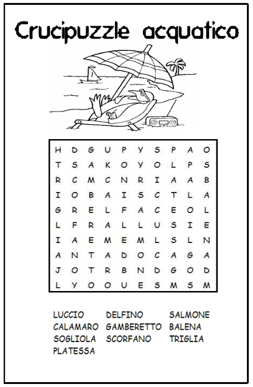

# Crucipuzzle 🏍

**Step 1:** Scrivere un programma che prende in input una matrice di caratteri e una parola e restituisce _true_ se questa si trova all’interno della matrice verticalmente o orizzontalmente, _false_ altrimenti.

**Step 2:** Fare in modo che il programma controlli anche se la parola è scritta al contrario.

**Step 3:** Controllare anche se la parola è presente in diagonale.

_Suggerimento_: scrivere una funzione che stampa a schermo la matrice.

