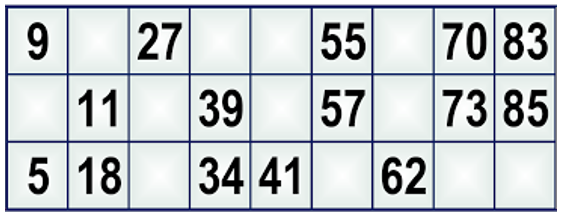

# Tombola 🏍

Scrivere un programma che prevede un metodo che prende in input una cartella della tombola sotto forma di matrice 3 * 5 e un array di numeri estratti (almeno 20 numeri, non ripetuti).

Il metodo controlla quanti ambi, terni, quaterne e cinquine sono presenti nella scheda e restituisce la stringa:

>Il giocatore ha totalizzato `<numero_ambi>` ambi, `<numero_terni>` terni, ecc.

In caso di tombola il metodo restituisce direttamente la stringa 
 
>TOMBOLA!

