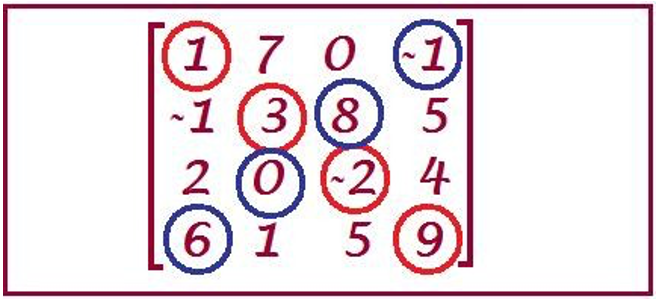

# Somma Diagonale 🏍

Scrivere un programma che prevede un primo metodo che, data una matrice quadrata in input, restituisce la somma della diagonale da sinistra a destra.
Implementare poi nel programma anche un secondo metodo che, presa una matrice quadrata e un booleano a seconda del valore del booleano restituisce o la somma della diagonale da sinistra a destra o quella da destra a sinistra.

_Suggerimento_: richiamare il primo metodo all’interno del secondo.

